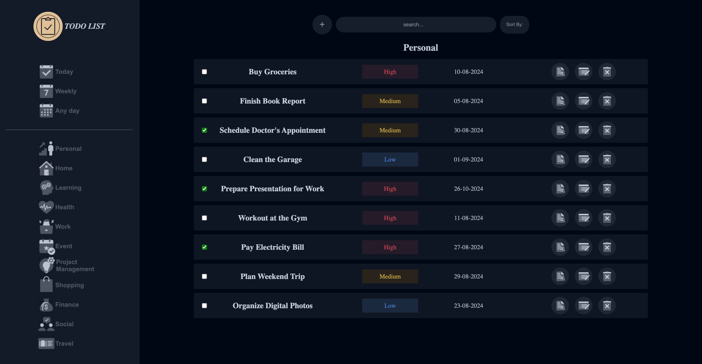

# Todo-list

## Preview



## Introduction

A comprehensive Todo List application designed with modular functionality and a clean user interface. This project uses modern JavaScript techniques and Webpack for bundling and development. This project is part of [The Odin Project](https://www.theodinproject.com/lessons/node-path-javascript-todo-list)'s curriculum.

## Features

- **Modular Task Management**: Supports different categories like Home, Health, Finance, etc.
- **Timeframe Views**: Includes views for tasks due today, any day, and weekly.
- **Task Sorting and Filtering**: Sort tasks by priority, title, completion status, and due date.
- **Search Task**: Allows you to search for tasks across different categories and timeframes.
- **Add Task**: Add new tasks to any category.
- **View Task**: View detailed information about tasks.
- **Edit Task**: Modify existing tasks, including updating title, details, and due date.
- **Delete Task**: Remove tasks that are no longer needed.

# Technologies Used

- HTML
- CSS
- JavaScript

## Prerequisites

- You need a modern web browser that supports HTML and CSS.
- [Node.js](https://nodejs.org/)
- npm (Node Package Manager), usually included with Node.js

## Setup and Installation

1. **Clone the Repository:**

   ```bash
   git clone <repository-url>
   cd <repository-directory>
   ```

2. **Install Dependencies:**

   ```bash
   npm install
   ```

3. **Development Server:**

   ```bash
   npm start
   ```

   Opens the application in your default browser and watches for changes.

4. **Build for Production:**
   ```bash
   npm run build
   ```
   Bundles the application for production, minifying CSS and JavaScript. This command creates a `dist/` directory that contains the production-ready files.

## Dependencies

The project relies on the following key dependencies:

- **Webpack**: For bundling JavaScript and CSS.
- **HtmlWebpackPlugin**: For injecting the script tag into the HTML file.
- **MiniCssExtractPlugin**: For extracting CSS into separate files.
- **CssMinimizerWebpackPlugin**: For CSS minification.
- **date-fns**: For date manipulation and formatting.

For a full list of dependencies, see the `package.json` file.

## Development Workflow

The development workflow involves setting up Webpack for efficient development and production builds. The following npm scripts are provided:

- **npm run start**: Starts the development server with hot module reloading.
- **npm run build**: Builds the project for production.

Make sure to run the development server while working on the project to see changes in real-time.

## Configuration

- **Port**: The development server runs on port 4000 by default. Adjust as needed in `webpack.dev.js`.
- **CSS and Asset Handling**: Managed with `css-loader`, `style-loader`, and `MiniCssExtractPlugin`.

## Project Structure

The project is structured as follows:

- **src/**: Contains the source files for the project.

  - **`asset/`**: Contains assets such as images.

  - **`Categories/`**: Contains files related to predefined and time frame categories.

    - `predefinedCategories.js`: Defines various predefined categories.
    - `timeFrameCategories.js`: Manages categories based on different time frames.

  - **`Class/`**: Contains class definitions related to the project.

    - `todoItems.js`: Manages individual task details.

  - **`Data/`**: Contains files for managing and retrieving task data.

    - `taskData.js`: Handles task data retrieval functions.

  - **`modal/`**: Contains files related to modal functionality.

    - `modal.js`: General modal functionality.
    - `taskDetailModal.js`: Manages task detail modals.

  - **`searchBar/`**: Contains files for search bar functionality.

    - `searchBar.js`: Manages search bar operations.
    - `searchPattern.js`: Defines search patterns.

  - **`sortBy/`**: Contains files for sorting and filtering tasks.

    - `filterButtons.js`: Manages sorting and filtering functionality.

  - **`taskActions/`**: Contains files related to task actions.

    - `taskEvents.js`: Manages events such as adding, updating, and deleting tasks.

  - **`Utils/`**: Contains utility functions used throughout the project.

    - `dateUtil.js`: Utilities for date handling.
    - `domUtil.js`: Utilities for DOM manipulation.
    - `formHelper.js`: Helpers for form operations.
    - `moduleUtils.js`: Module creation and management functions.
    - `priorityDom.js`: Manages priority-related DOM elements.
    - `tabUtil.js`: Utilities for tab management.

  - **`Validation/`**: Contains files for data validation.

    - `dataValidation.js`: Handles validation of task data.

  - **`app.js`**: The main JavaScript entry point.

  - **`index.html`**: The main HTML file for the application.

  - **`style.css`**: Contains the styles for the application.

- **dist/**: Output directory for the bundled files. If this directory doesn't exist, run the build script (`npm run build`) to generate it.
- **.gitignore**: Git configuration for ignoring certain files and directories.
- **webpack.common.js**: Common Webpack configuration.
- **webpack.dev.js**: Webpack configuration for development mode.
- **webpack.prod.js**: Webpack configuration for production mode.
- **package.json**: Project metadata and npm scripts.

## Credits

This project is created by [Jathusan08](https://github.com/Jathusan08). If you have any questions or suggestions, feel free to open an issue.

## License

This project is licensed under the [MIT License](LICENSE). Feel free to use, modify, and distribute the code.

## Acknowledgements

- **Webpack**: Bundling and module management.
- **CSS Loader and Mini CSS Extract Plugin**: For handling and optimising CSS.
- **date-fns**: For handling date operations and formatting.
